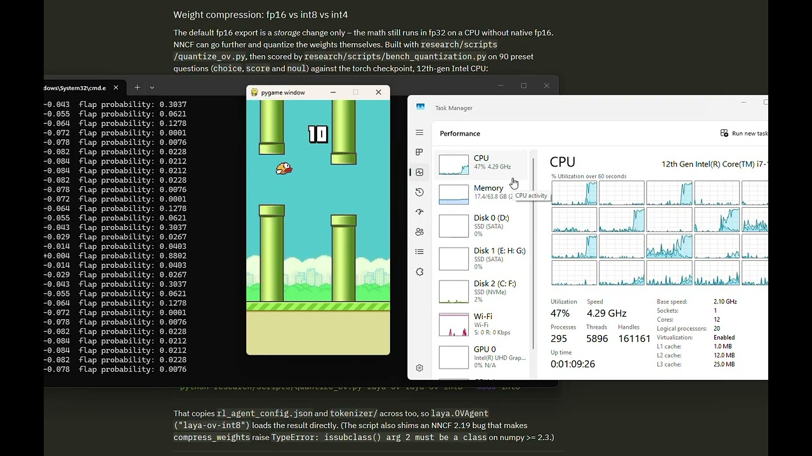

<h1 align="center">laya-openvino</h1>

<p align="center">
  <a href="https://huggingface.co/rupeshs/laya-ov-int8"></a>
  <a href="https://opensource.org/licenses/Apache-2.0"></a>
</p>

> **Unofficial OpenVINO-focused derivative of [Laya](https://github.com/NandhaKishorM/laya)** by Convai Innovations (Apache 2.0). Not affiliated with or endorsed by Convai Innovations. See [NOTICE](NOTICE) for the list of changes.

This fork adds an **OpenVINO backend** to Laya for fast CPU inference. Export a Laya checkpoint to OpenVINO IR once (or download a pre-converted one), then serve it with `OVAgent` -- the forward pass runs on OpenVINO, not torch.

> **Supported checkpoint:** the English model, [`convaiinnovations/laya`](https://huggingface.co/convaiinnovations/laya) (ModernBERT-large). The `laya-multilingual` and `laya-typed-decisions` checkpoints have not been exported or tested on OpenVINO.

For the model itself (question types, routing, benchmarks, fine-tuning), see the upstream project: **[NandhaKishorM/laya](https://github.com/NandhaKishorM/laya)**.

## Pre-converted model

| model | source checkpoint | weights | size | top-answer agreement vs torch |
|---|---|---|---|---|
| [`rupeshs/laya-ov-int8`](https://huggingface.co/rupeshs/laya-ov-int8) | [`convaiinnovations/laya`](https://huggingface.co/convaiinnovations/laya) (English) | int8 | 405 MB | 98.9% |

It contains the OpenVINO IR, the tokenizer and `rl_agent_config.json`, so `OVAgent` loads it directly. See [Option A](#option-a-download-the-pre-converted-int8-model) below.

---

## Installation

Not on PyPI. Install straight from GitHub; the import name is still `laya`:

```bash
pip install git+https://github.com/rupeshs/laya-openvino.git
```

This replaces the upstream PyPI `laya` package if it is installed in the same environment. Python 3.10 or newer.

---

## 1. Get an OpenVINO model

### Option A: download the pre-converted int8 model

[`rupeshs/laya-ov-int8`](https://huggingface.co/rupeshs/laya-ov-int8) is the English checkpoint, already exported and quantized to int8 (405 MB). Download it and skip the export step:

```python
from huggingface_hub import snapshot_download

snapshot_download("rupeshs/laya-ov-int8", local_dir="laya-ov-int8")
```

Use `local_dir` rather than the Hub cache: `OVAgent` patches `tokenizer_config.json` in place, and cache entries are symlinks into shared blobs.

### Option B: export it yourself

Exporting traces the original torch checkpoint (downloaded from the Hub on first run):

```bash
python -m laya.ov export convaiinnovations/laya --out laya-ov
```

| option | default | meaning |
|---|---|---|
| `model` | `convaiinnovations/laya` | Hub repo id or local checkpoint path |
| `--out` | `laya-ov` | output directory |
| `--fp32` | off | keep fp32 weights (default compresses to fp16) |

Or from Python:

```python
from laya.ov import export

export("convaiinnovations/laya", "laya-ov", compress_to_fp16=True)
```

The export directory is self-contained (IR, tokenizer and `rl_agent_config.json`), and batch, sequence and option-count axes all stay dynamic. To get int8 weights, see [Quantizing to int8](#quantizing-to-int8).

---

## 2. Run inference with `OVAgent`

```python
import laya
from huggingface_hub import snapshot_download

snapshot_download("rupeshs/laya-ov-int8", local_dir="laya-ov-int8")  # skip if you exported your own

agent = laya.OVAgent("laya-ov-int8")   # or "laya-ov"; device="CPU" by default

state = {
    "from": "user@acme.com",
    "subject": "Duplicate charge on invoice #4411",
    "body": "Hi, we were billed twice for March. Please refund the duplicate today or we will cancel our plan.",
}

questions = {
    "department": {
        "type": "choice",
        "instructions": "Which department should handle this request?",
        "criteria": {
            "billing": "invoices, payments, refunds",
            "technical": "bugs, outages, system errors",
            "sales": "pricing, new contracts",
            "other": "everything else",
        },
    },
    "urgency": {
        "type": "score",
        "instructions": "How urgent is this request?",
        "criteria": ["not urgent", "soon", "critical deadline or blocking issue"],
    },
    "churn_risk": {
        "type": "noul",
        "instructions": "Does the user threaten to cancel or leave?",
    },
}

answers = agent.predict(state, questions)["answers"]
print(answers["department"]["choice"], answers["department"]["confidence"])
print(answers["urgency"]["score"])
print(answers["churn_risk"]["noul"])
```

All questions are answered in a single forward pass. `OVAgent` returns exactly the same payload as the torch `Agent.predict`, and shares the same pre/post-processing and temperature calibration, so the two backends agree.

Pass OpenVINO compile options through `ov_config` (default `{"PERFORMANCE_HINT": "LATENCY"}`):

```python
agent = laya.OVAgent("laya-ov-int8", device="CPU", ov_config={"PERFORMANCE_HINT": "THROUGHPUT"})
```

The English checkpoint is trained on English text; accuracy drops sharply on other languages, especially non-Latin scripts, while its confidence stays high. Only send it English input.

---

## 3. Try the Gradio demo

[`examples/app.py`](examples/app.py) is a web demo: pick a preset (sentiment, support triage, phishing, LLM guard, moderation, model routing) or write your own state and questions, and see the answers with their latency. On first run it downloads [`rupeshs/laya-ov-int8`](https://huggingface.co/rupeshs/laya-ov-int8) (405 MB) into `examples/laya-ov-int8/`.

From the `examples/` folder:

```bash
pip install -r requirements.txt
python app.py
```

or with [uv](https://docs.astral.sh/uv/):

```bash
uv run --no-project --with-requirements requirements.txt app.py
```

Then open http://127.0.0.1:7860.

The demo runs on the CPU by default. To use another OpenVINO device, such as an Intel integrated GPU, set `LAYA_DEVICE` (`CPU`, `GPU`, `GPU.0`, `GPU.1`, ...):

```bash
LAYA_DEVICE=GPU python app.py            # Linux / macOS
$env:LAYA_DEVICE = "GPU"; python app.py  # Windows PowerShell
```

The device in use is printed at startup and shown on the page. A GPU is not always faster: on an i7-12700, its UHD Graphics 770 iGPU took 241 ms per request against 48 ms on the CPU.

---

## 4. Flappy Bird example

[flappy-laya-openvino-cpu](https://github.com/rupeshs/flappy-laya-openvino-cpu) is a Flappy Bird game played by Laya running on the OpenVINO backend on CPU.



Watch it play: [YouTube demo](https://www.youtube.com/watch?v=YfT6GL9sqwk)

---

## Performance

Measured on a 12th-gen Intel CPU, three questions over a short state: **301 ms torch → 180 ms OpenVINO (1.7x)**, with top answers unchanged and probabilities agreeing to within 0.0001. Your numbers will differ by CPU.

### Weight compression: fp16 vs int8 vs int4

The default fp16 export is a *storage* change only -- the math still runs in fp32 on a CPU without native fp16. NNCF can go further and quantize the weights themselves. Built with `research/scripts/quantize_ov.py`, then scored by `research/scripts/bench_quantization.py` on 90 preset questions (`choice`, `score` and `noul`) against the torch checkpoint, 12th-gen Intel CPU:

| weights | size | top-answer agreement | mean dp | max dp | 1 question | 5 questions |
|---|---|---|---|---|---|---|
| torch fp32 | -- | reference | -- | -- | 136 ms | 815 ms |
| fp16 (default) | 805 MB | **100.0%** | 0.0001 | 0.0017 | 90 ms | 554 ms |
| **int8** | 405 MB | 98.9% | 0.0087 | 0.145 | **40 ms** | **272 ms** |
| int4 | 243 MB | 93.3% | 0.0460 | 0.688 | 40 ms | 291 ms |

**int8 is the setting worth shipping**: half the size of fp16, 3.4x faster than torch on a single question, and it still reproduces 98.9% of the torch top answers.

**int4 is not worth it.** It saves a further 162 MB, but it is *not* faster than int8 -- both dequantize to the same compute path -- and it is the only variant that changes answers often enough to notice. It also disturbs probabilities much more than top answers (up to 0.69), so anything that thresholds a probability -- confidence gating, a `noul` cutoff -- degrades badly: on a control task thresholding a `noul` at 0.5, fp16 and int8 score 100% while every int4 config tested lands between 35% and 65%.

### Quantizing to int8

The exporter has no `--int8` flag; quantize the IR after exporting. This step needs [NNCF](https://github.com/openvinotoolkit/nncf):

```bash
pip install nncf
python -m laya.ov export convaiinnovations/laya --out laya-ov
python research/scripts/quantize_ov.py laya-ov laya-ov-int8 --mode int8
```

That copies `rl_agent_config.json` and `tokenizer/` across too, so `laya.OVAgent("laya-ov-int8")` loads the result directly. (The script also shims an NNCF 2.19 bug that makes `compress_weights` raise `TypeError: issubclass() arg 2 must be a class` on numpy >= 2.3.)

---

## License

Apache 2.0, see [LICENSE](LICENSE). Original work developed by Convai Innovations ([NandhaKishorM/laya](https://github.com/NandhaKishorM/laya)).

OpenVINO backend and related modifications © 2026 Rupesh Sreeraman, also under Apache 2.0. See [NOTICE](NOTICE) for what changed. Model checkpoints on the Hugging Face Hub are covered by their own licenses.
